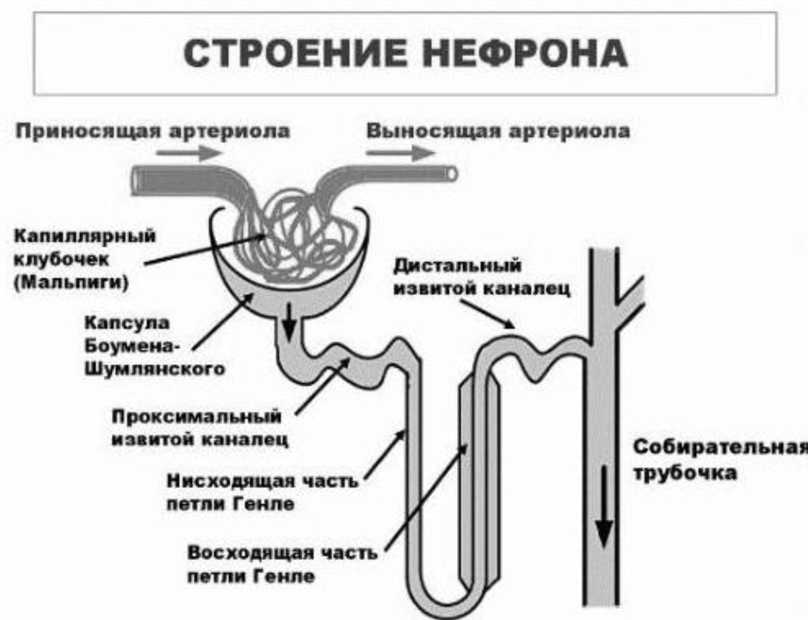
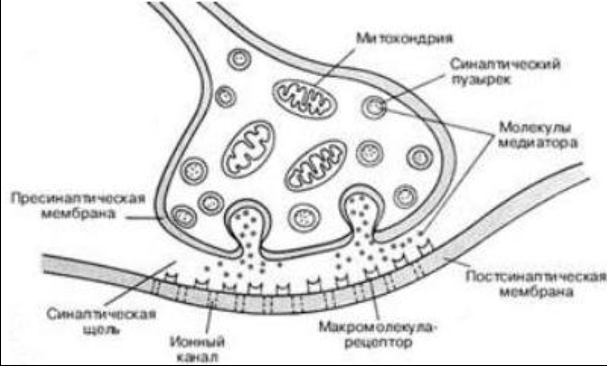

# 📚 Физиология — Экзамен 2025

> [!abstract] Навигация по разделам
> - [🩸 Раздел I: Кровь (вопросы 1–25)](#раздел-i-кровь).
> - [❤️ Раздел II: Сердечно-сосудистая система (26–35)](#Раздел%20II%20Сердечно-сосудистая%20система)
> - [🫁 Раздел III: Дыхание (36–41)](#Раздел%20III%20Дыхательная%20система)
> - [🍎 Раздел IV: Пищеварение (42–48)](#Раздел%20IV%20Пищеварение)
> - [🌡️ Раздел V: Обмен веществ и терморегуляция (48–50)](#Раздел%20V%20Обмен%20веществ%20и%20терморегуляция)
> - [🫘 Раздел VI: Почки (51–52)](#Раздел%20VI%20Почки)
> - [🧠 Раздел VII: Нервная система (53–62)](#Раздел%20VII%20Нервная%20система)

---

# Раздел I: Кровь

## 1. Кровь — внутренняя среда организма. Функции крови. Состав

> [!definition] Кровь
> Многокомпонентная жидкость красного цвета, состоящая из **плазмы** и **форменных элементов**, характеризующаяся слабощелочной реакцией.

**Система крови** включает:
- Периферическую (циркулирующую или депонированную) кровь
- Органы кроветворения: красный костный мозг, тимус, селезёнка
- Органы кроверазрушения

### Форменные элементы крови

**Эритроциты, лейкоциты и тромбоциты.** На долю форменных элементов приходится около 40–45% от общего объёма крови. Эритроцитов значительно больше, чем лейкоцитов и тромбоцитов — именно они определяют реологические свойства крови.

### Функции крови

| Функция | Характеристика |
|---|---|
| **Транспортная** | Основная система транспорта веществ в организме |
| **Дыхательная** | Перенос O₂ от лёгких к тканям и CO₂ — обратно |
| **Питательная** | Транспорт к клеткам веществ, необходимых для жизнедеятельности |
| **Выделительная** | Перенос продуктов метаболизма к органам выделения |
| **Терморегуляторная** | Перенос тепла от внутренних органов к поверхности тела |
| **Защитная** | Свёртывание крови + иммунная защита |
| **Регуляторная** | Перенос веществ гуморальной регуляции |

---

## 2. Гематокрит. Нормальные значения. Факторы, влияющие на гематокрит

> [!definition] Гематокрит
> Часть объёма крови, приходящаяся на долю форменных элементов (преимущественно эритроцитов). Определяется центрифугированием.

> [!important] Нормальные значения
> - **Мужчины:** 40–48%
> - **Женщины:** 36–42%

**Повышение гематокрита:**
- Обезвоживание (потеря плазмы, эритроциты остаются в сосудистом русле)
- Адаптация к высокогорью (гипоксия → усиление эритропоэза)
- Следствие: увеличение вязкости крови и ухудшение её текучести

**Снижение гематокрита:**
- Кровопотеря (вода переходит в кровоток, а восстановление эритроцитов через гемопоэз занимает время)
- Гемолиз эритроцитов

---

## 3. Белки плазмы крови. Функции основных фракций. Количество общего белка

> [!important] Общее количество белка плазмы
> **64–83 г/л**

Органические вещества плазмы в основном представлены белками. Выделяют три фракции: **альбумины**, **глобулины**, **фибриноген**.

### Альбумины
Низкомолекулярные белки глобулярной формы. Самая многочисленная фракция — **~40 г/л**.

**Функции:**
- Удержание воды в сосудистом русле (онкотическое давление)
- Транспорт солей желчных кислот, жирных кислот, билирубина, гормонов, витаминов, катионов, лекарств
- Белковый резерв организма

### Глобулины (~32,6 г/л)

Белки глобулярной формы, молекулярная масса значительно больше, чем у альбуминов.

| Подфракция | Белки | Функция |
|---|---|---|
| **α₁-глобулины** | Гликопротеины, транскобаламины, транскортин | Связывают глюкозу, транспортируют В₁₂ и кортизол |
| **α₂-глобулины** | Церулоплазмин, гаптоглобин | Оксидазная активность; транспорт гемоглобина при гемолизе |
| **β-глобулины** | β-липопротеины | Транспорт нерастворимых в воде липидов |
| **γ-глобулины** | Иммуноглобулины (антитела) | Специфический гуморальный иммунитет |

> [!note] Диагностическое значение
> **Альбумино-глобулиновый коэффициент** = 40 / 32,6 = **1,2** (норма).
> Снижение коэффициента указывает на воспалительный процесс.
> Уровень α-глобулинов возрастает при острых и хронических заболеваниях.
> Уровень γ-глобулинов возрастает при появлении чужеродных агентов.

### Фибриноген (~3,0 г/л)

Крупнодисперсный фибриллярный белок. Является растворимым предшественником **фибрина** — белка, формирующего тромб при свёртывании крови.

---

## 4. Осмотическое и онкотическое давление крови. Нормальные значения. Факторы, влияющие на них

> [!definition] Осмотическое давление крови
> Давление, создаваемое разницей концентрации растворённых веществ (осмолитов) между кровью и тканевыми жидкостями.

> [!important] Нормы
> - **Осмотическое давление:** ~280–296 мОсм/кг
> - **Онкотическое давление:** ~25–30 мм рт. ст.

**Факторы, влияющие на осмотическое давление:**
- Концентрация раствора и температура
- Уровень белков, глюкозы, азотистых веществ в плазме
- Уровень электролитов (Na⁺, K⁺)

> [!definition] Онкотическое давление
> Давление, создаваемое **белками** плазмы крови. Способствует удержанию жидкости в сосудах и препятствует её выходу в ткани.

---

## 5. Физиологический (изотонический) раствор. Влияние гипо- и гиперосмолярности на клетки крови

> [!definition] Физиологический раствор
> Раствор с такой же осмотической активностью, как внутренняя среда организма. Не вызывает осмотического тока воды в клетки или из них.
> **0,9% водный раствор NaCl**

### Гиперосмолярность плазмы
- **Дегидратация клеток** — вода уходит из клеток во внеклеточное пространство
- **Сжатие клеток** — уменьшение объёма, нарушение функции
- **Повреждение и гибель клеток** при выраженном дефиците воды

### Гипоосмолярность плазмы
- **Осмотическое вздутие клеток** — вода поступает из внеклеточного пространства в клетки
- **Разрушение клеток** — при сильной гипоосмолярности избыток воды вызывает разрыв мембраны

---

## 6. Гемолиз эритроцитов. Виды гемолиза

> [!definition] Гемолиз
> Разрушение эритроцитов с выбросом гемоглобина в плазму крови.

### Физиологический гемолиз

**Возрастной гемолиз** — разрушение эритроцитов в процессе естественного старения (~120 дней жизни). Макрофаги селезёнки и печени захватывают старые или повреждённые клетки.

### Патологический гемолиз

- **Аутоиммунный** — иммунная система атакует собственные эритроциты (например, при идиопатической гемолитической анемии)
- **Инфекционный** — вызван инфекциями (малярия: паразиты проникают в эритроциты)
- **Механический** — травмы или медицинские устройства (например, аппараты ИВЛ)
- **Токсический** — действие токсинов и ядов, нарушающих целостность мембраны
- **Температурный** — резкие перепады температуры (переохлаждение)
- **Осмотический** — помещение эритроцитов в гипотонический раствор → избыточное поглощение воды → разрыв мембраны

---

## 7. pH крови. Нормальные значения. Ацидоз, алкалоз

> [!important] Норма pH крови
> **7,35–7,45**

### Ацидоз

Снижение pH ниже нормы (< 7,35). Причины — увеличение концентрации кислот или снижение концентрации оснований.

- **Респираторный ацидоз** — нарушение функции лёгких (пневмония, бронхит)
- **Метаболический ацидоз** — нарушение обмена веществ (диабет, почечная недостаточность)

### Алкалоз

Повышение pH выше нормы (> 7,45). Причины — снижение концентрации кислот или увеличение концентрации оснований.

- **Респираторный алкалоз** — увеличение частоты и глубины дыхания (стресс, тревога)
- **Метаболический алкалоз** — избыточное введение щелочей (некоторые лекарственные препараты)

---

## 8. Эритроциты. Строение, заряд, количество, физиологическая роль

> [!definition] Эритроциты
> Форменные элементы крови, осуществляющие дыхательную функцию — перенос O₂ от лёгких к тканям и CO₂ от тканей к лёгким.

### Строение

- **Форма:** двояковогнутая (дископодобная) — увеличивает площадь поверхности для газообмена и позволяет проходить через узкие капилляры
- **Размер:** диаметр ~7–8 мкм
- **Мембрана:** фосфолипидный бислой с белками — транспорт веществ, поддержка формы, взаимодействие с другими клетками
- **Гемоглобин:** четыре глобиновых цепи с гемовыми группами — связывает O₂ в лёгких
- **Нет ядра и органелл** — это освобождает место для гемоглобина

**Заряд:** эритроциты имеют **отрицательный заряд** на поверхности (за счёт гликопротеинов и гликолипидов), что препятствует их агрегации.

> [!important] Нормальное количество эритроцитов
> - **Мужчины:** 4,7–6,1 × 10⁶ / мкл
> - **Женщины:** 4,2–5,4 × 10⁶ / мкл

### Функции

1. Перенос O₂ от лёгких к тканям
2. Транспорт CO₂ от тканей к лёгким
3. Транспорт воды от тканей к лёгким (выделяется в виде пара)
4. Участие в свёртывании крови (эритроцитарные факторы свёртывания)
5. Перенос аминокислот на поверхности
6. Регуляция вязкости крови: за счёт пластичности эритроцитов вязкость в мелких сосудах меньше, чем в крупных

---

## 9. Эритропоэз. Факторы, влияющие на эритропоэз

> [!definition] Эритропоэз
> Процесс образования эритроцитов в организме (в красном костном мозге).

**Факторы, влияющие на эритропоэз:**
- **Эритропоэтин** — гормон почек, синтезируется в ответ на гипоксию; стимулирует продукцию и созревание эритроцитов
- **Железо** — необходимо для синтеза гемоглобина; дефицит → железодефицитная анемия
- **Витамин B₁₂ и фолиевая кислота** — необходимы для синтеза ДНК; дефицит → мегалобластная анемия
- **Гормоны** — тестостерон и гормоны щитовидной железы также влияют на эритропоэз
- **Факторы внешней среды** — высота над уровнем моря, физическая активность, температура

---

## 10. Эритроцитоз и эритропения. Абсолютный и относительный эритроцитоз

### Эритроцитоз

Повышенное количество эритроцитов в крови.

**Абсолютный эритроцитоз** — увеличение общего числа эритроцитов вследствие усиленного эритропоэза.
- Хронические заболевания лёгких (гипоксия → стимуляция эритропоэза)
- Опухоли, вырабатывающие эритропоэтин
- Первичная полицитемия (болезнь Вакеза)

**Относительный эритроцитоз** — увеличение концентрации эритроцитов вследствие уменьшения объёма плазмы (не увеличения их числа).
- Обезвоживание (рвота, диарея, потоотделение)
- Применение диуретиков

### Эритропения

Снижение количества эритроцитов в крови.
- Дефицит железа, B₁₂ или фолиевой кислоты
- Угнетение функции костного мозга (апластическая анемия, воздействие токсинов)
- Усиленный гемолиз (аутоиммунные расстройства, наследственные анемии)

---

## 11. Гемоглобин. Соединения гемоглобина с газами. Типы гемоглобина

> [!definition] Гемоглобин
> Сложный белок, состоящий из белковой части — **глобина** (4 полипептидных цепи) и небелковой — **гема** (4 молекулы пиррола с атомом Fe²⁺ в центре).

В каждом эритроците содержатся сотни тысяч молекул гемоглобина. Каждая из четырёх полипептидных субъединиц содержит один гем, расположенный в специальных карманах.

### Типы гемоглобина

| Тип | Описание | Состав |
|---|---|---|
| **HbA** | Гемоглобин взрослых (adult) | α₂β₂ |
| **HbF** | Гемоглобин плода (fetus) — более высокое сродство к O₂ | α₂γ₂ |

### Соединения гемоглобина с газами

- **Оксигемоглобин (HbO₂)** — соединение с O₂ (в лёгких); Fe²⁺ не меняет степень окисления
- **Дезоксигемоглобин (восстановленный Hb)** — после отдачи O₂ тканям
- **Карбгемоглобин (HbCO₂)** — соединение с CO₂ (в тканях; CO₂ связывается с глобином, а не с гемом)
- **Карбоксигемоглобин (HbCO)** — соединение с CO (угарный газ); сродство к CO в ~200 раз выше, чем к O₂ → блокирует перенос кислорода
- **Метгемоглобин (MetHb)** — Fe²⁺ окисляется до Fe³⁺ → не способен связывать O₂

> [!important] Содержание гемоглобина в норме
> - **Мужчины:** 130–170 г/л
> - **Женщины:** 120–150 г/л

---

## 12. Цветовой показатель. Скорость оседания эритроцитов (СОЭ)

> [!definition] Цветовой показатель (ЦП)
> Относительное содержание гемоглобина в одном эритроците.
> **ЦП = (Hb [г/л] × 0,03) / количество эритроцитов [10¹²/л]**

> [!important] Норма ЦП
> **0,85–1,05**
> - ЦП < 0,85 → **гипохромия** (железодефицитная анемия)
> - ЦП > 1,05 → **гиперхромия** (В₁₂-дефицитная анемия)

> [!definition] СОЭ
> Скорость, с которой эритроциты оседают в пробирке с антикоагулянтом за 1 час.

> [!important] Норма СОЭ
> - **Мужчины:** 2–10 мм/ч
> - **Женщины:** 3–15 мм/ч

**Факторы, увеличивающие СОЭ:**
- Воспаление (повышение глобулинов и фибриногена → агрегация эритроцитов)
- Анемия
- Беременность

---

## 13. Лейкоциты. Морфофункциональная характеристика, количество, функции

> [!definition] Лейкоциты
> «Белые» клетки крови диаметром 20–70 мкм. Имеют ядро и цитоплазму. Ответственны за защиту организма от инфекций.

> [!important] Норма лейкоцитов
> **4–9 × 10⁹ / л**
> - Увеличение → **лейкоцитоз** (при инфекции, воспалении)
> - Снижение → **лейкопения**

### Классификация

Лейкоциты классифицируют по: диаметру, форме ядра, наличию гранул в цитоплазме, окрашиванию.

**Гранулоциты** (есть гранулы): эозинофилы, базофилы, нейтрофилы (юные, палочкоядерные, сегментоядерные)

**Агранулоциты** (нет гранул): моноциты, лимфоциты

### Функции

- Выработка антител
- Фагоцитоз и уничтожение бактерий, чужеродных белков
- Нейтрализация внешних угроз
- Уничтожение мутировавших или отмерших клеток

---

## 14. Лейкоцитарная формула. Функциональные особенности гранулоцитов

> [!definition] Лейкоцитарная формула
> Процентное содержание различных типов лейкоцитов в общем числе лейкоцитов в крови.

### Гранулоциты

**1. Нейтрофилы (50–70%)**
- Фагоцитоз бактерий и грибов
- Выделяют ферменты и активные формы кислорода для уничтожения патогенов
- Мигрируют к месту инфекции по хемотаксису

**2. Эозинофилы (1–4%)**
- Участие в аллергических реакциях
- Борьба с паразитарными инфекциями

**3. Базофилы (0–1%)**
- Участие в аллергических реакциях
- Регуляция воспалительных процессов

---

## 15. Лейкоцитарная формула. Функциональные особенности агранулоцитов

### Агранулоциты

**1. Лимфоциты (20–40%)** — ключевые клетки адаптивного иммунного ответа.

*Т-лимфоциты:*
- **Цитотоксические (T-киллеры)** — уничтожают инфицированные вирусом и раковые клетки
- **Т-хелперы** — активируют другие клетки иммунной системы, регулируют иммунный ответ

*В-лимфоциты:*
- **Плазматические клетки** — производят антитела
- **Клетки памяти** — запоминают антигены для быстрого реагирования при повторном заражении

*NK-клетки (естественные киллеры):*
- Противоопухолевый иммунный ответ без предварительной активации

**2. Моноциты (3–8%)** — крупные клетки, в тканях преобразуются в макрофаги и дендритные клетки.
- **Фагоцитоз** — поглощение патогенов, мёртвой ткани, клеточного мусора
- **Презентация антигенов** Т-лимфоцитам → запуск адаптивного иммунного ответа
- **Секреция цитокинов** — регуляция воспаления и привлечение других иммунных клеток

---

## 16. Иммунитет. Специфический и неспецифический иммунитет

> [!definition] Иммунитет
> Способность организма распознавать и защищаться от чужеродных веществ (антигенов) — вирусов, бактерий, грибов, паразитов, токсинов.

**Неспецифический (врождённый) иммунитет** — первичная защитная реакция без учёта конкретного патогена. Быстрая реакция, нет долгосрочной памяти.
- Физические барьеры (кожа, слизистые)
- Фагоциты, NK-клетки, система комплемента

**Специфический (адаптивный) иммунитет** — направленная защита против конкретного антигена. Формируется после контакта с антигеном; есть иммунологическая память.
- **Клеточный иммунитет** — Т-лимфоциты
- **Гуморальный иммунитет** — В-лимфоциты и антитела

---

## 17. Антигены и антитела. Классификация антител

> [!definition] Антиген
> Молекула, способная вызывать иммунный ответ и стимулировать выработку антител. Может быть белком, полисахаридом и другими веществами на поверхности патогенов.

> [!definition] Антитела (иммуноглобулины)
> Белки, вырабатываемые В-лимфоцитами в ответ на антигены. Связываются с антигенами, нейтрализуя их или помечая для уничтожения.

### Классификация антител

| Класс | Содержание | Характеристика |
|---|---|---|
| **IgG** | ~75% от всех | Длительная защита, память. Проникает через плаценту |
| **IgA** | В секретах | Защищает слизистые (слюна, слёзы, грудное молоко) |
| **IgM** | Кровь и лимфа | Первый ответ на инфекцию, агглютинация, активация комплемента |
| **IgE** | Следовые количества | Аллергические реакции, защита от паразитов |
| **IgD** | Поверхность В-лимфоцитов | Активация В-лимфоцитов (рецепторная функция) |

---

## 18. Группы крови по системе ABO

Система ABO основана на наличии или отсутствии антигенов на поверхности эритроцитов.

| Группа | Антиген на эритроцитах | Антитела в плазме |
|---|---|---|
| **I (O)** | Нет | Анти-A и анти-B |
| **II (A)** | A | Анти-B |
| **III (B)** | B | Анти-A |
| **IV (AB)** | A и B | Нет |

> [!note] Диагностическое значение
> Антигены определяют группу крови и обладают иммунной активностью.
> Антитела образуются в ответ на чужеродные антигены и вызывают агглютинацию при несовместимости.

---

## 19. Резус-принадлежность. Принципы переливания крови с учётом резус-принадлежности

> [!definition] Резус-фактор (Rh)
> Белок (D-антиген) на поверхности эритроцитов. При наличии — Rh⁺, при отсутствии — Rh⁻.

**Антиген D:** основной антиген системы резус. У Rh⁻ людей антитела к D-антигену в норме отсутствуют — они могут появиться только после контакта с Rh⁺ кровью (переливание, беременность).

### Принципы переливания с учётом резуса

- **Rh⁺ реципиент** → может получать кровь от Rh⁺ и Rh⁻ доноров
- **Rh⁻ реципиент** → должен получать кровь только от Rh⁻ донора. Получение Rh⁺ крови → иммунный ответ → опасные осложнения

---

## 20. Резус-конфликт в акушерской практике

> [!warning] Резус-конфликт
> Иммунная реакция Rh⁻ матери против эритроцитов Rh⁺ плода.

### Механизм

1. **Сенсибилизация** — при беременности или родах эритроциты Rh⁺ плода попадают в кровь Rh⁻ матери
2. **Выработка антител** — иммунная система матери синтезирует антитела против D-антигена
3. **Повторная беременность** — при Rh⁺ плоде имеющиеся антитела проникают через плаценту и разрушают его эритроциты

### Последствия

- **Гемолитическая болезнь новорождённого (ГБН):** анемия, желтуха, отёки (гидропс)
- В тяжёлых случаях — внутриутробная гибель плода

### Профилактика

- Определение резус-фактора при первом посещении врача
- **Анти-D иммуноглобулин** Rh⁻ матери вводится:
  - На 28 неделе беременности
  - В течение 72 часов после родов (если ребёнок Rh⁺)
  - После амниоцентеза, травм, абортов

---

## 21. Тромбоциты. Функциональная характеристика, нормальные значения, физиологическая роль

> [!definition] Тромбоциты
> Кровяные пластинки — мелкие постклеточные формы тромбоцитарного ряда. Образуются в костном мозге из мегакариоцитов.

> [!important] Норма тромбоцитов
> **150–400 × 10⁹ / л**

### Физиологическая роль

- **Гемостаз** — при повреждении сосуда быстро активируются и образуют тромбоцитарную пробку
- **Восстановление тканей** — выделяют факторы роста, поддерживающие заживление
- **Участие в воспалении** — взаимодействуют с клетками иммунной системы
- **Защита от инфекций** — связываются с бактериями и вирусами

---

## 22. Сосудисто-тромбоцитарный гемостаз

Первичный механизм остановки кровотечения при повреждении сосудов.

**Этапы:**

1. **Рефлекторный спазм сосуда** — временное уменьшение кровотока
2. **Выделение фактора Виллебранда** — из разрушенных эндотелиальных клеток; связывается с коллагеном повреждённого участка
3. **Адгезия тромбоцитов** — прилипают к фактору Виллебранда через рецепторы к коллагену
4. **Активация тромбоцитов** — выделяют АДФ, активируют ферменты, высвобождают Ca²⁺ из гранул
5. **Формирование псевдоподий** — Ca²⁺ активирует сократительные белки, меняя форму тромбоцитов
6. **Дегрануляция** — тромбоксан A2 и другие медиаторы усиливают агрегацию
7. **Агрегация тромбоцитов** — соединяются между собой через фибриноген, образуя тромбоцитарную пробку

---

## 23. Свёртывающая система крови. Стадии свёртывания

Свёртывающая система обеспечивает остановку кровотечения и восстановление целостности сосудов.

### Стадия 1: Активация (инициация)

- Повреждение сосуда → выделение факторов из разрушенных клеток
- Активация тромбоцитов → выделение тромбоксана A2 и АДФ

### Стадия 2: Коагуляция (каскад свёртывания)

- Последовательная активация свёртывающих факторов плазмы (каскадный механизм)
- Протромбин → **тромбин** (под действием факторов коагуляции)
- Тромбин → превращает **фибриноген → фибрин** (образование сгустка)

### Стадия 3: Ретракция и заживление

- Ретракция сгустка — тромбоциты уменьшают размеры сгустка
- Постепенное замещение сгустка новыми клетками, восстановление сосуда

---

## 24. Естественные антикоагулянты. Антисвёртывающая система крови

| Антикоагулянт | Функция |
|---|---|
| **Антитромбин III (AT-III)** | Ингибирует тромбин и другие факторы коагуляции |
| **Протеин C** | Ингибирует факторы V и VIII |
| **Протеин S** | Усиливает действие протеина C |
| **Ингибитор плазминогена (PAI-1)** | Предотвращает избыточный фибринолиз |
| **Гепарин** | Ускоряет действие AT-III; блокирует тромбин |
| **Тромбомодулин** | Регулирует активность тромбина; стимулирует ингибицию V и VIII |

---

## 25. Фибринолитическая система. Стадии фибринолиза

> [!definition] Фибринолитическая система
> Система расщепления фибрина в плазме крови. Контролирует рассасывание тромбов и препятствует их избыточному накоплению.

### Стадии фибринолиза

1. **Активация тканевого активатора плазминогена (t-PA)** — на поверхности эндотелиальных клеток
2. **Активация плазминогена** → **плазмин**
3. **Расщепление фибрина** плазмином → растворимые фрагменты (продукты деградации фибрина, ПДФ)

> [!note]
> Нарушение регуляции фибринолиза → кровотечение (избыточный фибринолиз) или тромбоз (недостаточный фибринолиз).

---

# Раздел II: Сердечно-сосудистая система

## 26. Физиологические свойства сердечной мышцы. Автоматизм. Проводящая система сердца

**Физиологические свойства миокарда:**
- **Автоматия** — способность самостоятельно генерировать импульсы
- **Возбудимость** — способность отвечать на раздражение
- **Проводимость** — способность проводить возбуждение
- **Сократимость** — способность укорачиваться при возбуждении

> [!note] Автоматизм
> Главный генератор импульсов — **синусовый узел** (СА-узел) — задаёт ритм 60–100 уд./мин в покое. При повреждении СА-узла его функцию берут на себя нижележащие центры (АВ-узел, волокна Пуркинье) с более низкой частотой — **закон градиента автоматизма**.

### Проводящая система сердца

1. **Синоатриальный узел (СА-узел)** — правое предсердие, около устья верхней полой вены
2. **Пучок Бахмана** — от СА-узла к левому предсердию
3. **Пучок Венкебаха** — средний отдел СА-узла → АВ-узел
4. **Пучок Тореля** — задний отдел СА-узла → АВ-узел
5. **Атриовентрикулярный узел (АВ-узел)** — межпредсердная перегородка; связывает миокард предсердий и желудочков
6. **Пучок (ствол) Гиса** — перепончатая часть межжелудочковой перегородки
7. **Ножки пучка Гиса** (правая и левая) — межжелудочковая перегородка, до сосочковых мышц
8. **Волокна Пуркинье** — ветвящаяся сеть субэндокардиально в желудочках

---

## 27. Сердечный цикл. Систола желудочков. Звуковые явления

> [!definition] Сердечный цикл
> Время, в течение которого предсердия и желудочки совершают полный цикл сокращений и расслаблений.
> При ЧСС 75 уд./мин — длительность **0,8 с**.

**Систола желудочков** — изгнание крови в аорту и лёгочный ствол. Начинается при конечном диастолическом объёме ~130 мл.

### Фазы систолы желудочков

| Фаза | Длительность | Характеристика |
|---|---|---|
| Асинхронное сокращение | 0,05 с | Изменение формы желудочков, давление низкое. Закрытие АВ-клапанов (1-й компонент I тона) |
| Изоволюметрическое сокращение | 0,03 с | Все клапаны закрыты, объём не меняется. Желудочки шарообразные, ударяются о грудную клетку (2-й компонент I тона) |
| Быстрое изгнание | 0,1 с | Открытие полулунных клапанов, кровь с силой выбрасывается (3-й компонент I тона) |
| Медленное изгнание | >0,15 с | Выброс затрудняется, кровь поступает по инерции. Колебания клапанов → I тон |

### Тоны сердца при систоле

- **S1 (I тон)** — закрытие АВ-клапанов (митрального и трикуспидального). Глубокий, низкочастотный
- **S2 (II тон)** — закрытие полулунных клапанов (аортального и лёгочного). Короткий, высокий

---

## 28. Диастола желудочков. Периоды и фазы

Диастола желудочков состоит из 4 фаз.

| Фаза | Длительность | Характеристика |
|---|---|---|
| **I. Протодиастолическая** | 0,04 с | Кровь устремляется к желудочкам → закрытие полулунных клапанов → II тон |
| **II. Изоволюметрическое расслабление** | 0,08 с | Все клапаны закрыты, давление падает до открытия АВ-клапанов |
| **III. Быстрое заполнение** | 0,08–0,09 с | Кровь из предсердий быстро поступает в желудочки. Вибрация стенок → III тон |
| **IV. Медленное заполнение** | 0,16–0,17 с | Систола предсердий добавляет кровь в желудочки. Вибрация → IV тон |

---

## 29. Тоны сердца. Происхождение и компоненты

| Тон | Тип | Происхождение |
|---|---|---|
| **I тон** | Постоянный | 4 компонента: клапанный (АВ-клапаны), мышечный (сокращение миокарда), сосудистый (растяжение аорты), предсердный |
| **II тон** | Постоянный | 2 компонента: клапанный (полулунные клапаны) + сосудистый |
| **III тон** | Непостоянный | Колебания стенок желудочков при быстром наполнении в диастолу |
| **IV тон** | Непостоянный | Колебания при наполнении желудочков во время систолы предсердий (пресистола) |
| **Добавочные** | — | Тон открытия митрального клапана, систолический щелчок, перикардтон |

---

## 30. Электрокардиограмма. Электрокардиографические отведения

> [!definition] ЭКГ
> Графическое отражение биоэлектрических процессов сердца. Регистрирует разность потенциалов электрического поля сердца в точках на поверхности тела.

### 12 стандартных отведений

**Стандартные двухполюсные (I, II, III)** — фиксируют разность потенциалов между конечностями во фронтальной плоскости:
- I — левая рука (+) и правая рука (−)
- II — левая нога (+) и правая рука (−)
- III — левая нога (+) и левая рука (−)

**Усиленные однополюсные от конечностей:**
- aVR — правая рука
- aVL — левая рука
- aVF — левая нога

**Грудные однополюсные (V1–V6):**
- V1 — IV межреберье у правого края грудины
- V2 — IV межреберье у левого края грудины
- V3 — посередине между V2 и V4
- V4 — V межреберье, левая срединно-ключичная линия
- V5 — V межреберье, левая передняя подмышечная линия
- V6 — V межреберье, левая средняя подмышечная линия

---

## 31. Потенциалы действия пейсмекерных клеток и клеток сократительного миокарда

### Пейсмекерные клетки СА-узла

Особенность — **нестабильный мембранный потенциал** в диастолу (спонтанная диастолическая деполяризация).

**Фазы:**
- **Медленная деполяризация** — спонтанный ток ионов Ca²⁺ и Na⁺ снижает МП
- **Быстрая деполяризация** — при -60 мВ максимальная проницаемость для Ca²⁺
- **Реполяризация** — снижение проницаемости для Ca²⁺, выход K⁺

### Клетки сократительного миокарда

Особенность — **устойчивый потенциал покоя** = −90 мВ в диастолу.

**Фазы:**
- **Деполяризация** — быстрое открытие Na⁺-каналов (лавинообразно)
- **Начальная реполяризация** (плато) — вход Ca²⁺ через медленные кальциевые каналы уравновешивает выход K⁺ → формирует плато
- **Быстрая реполяризация** — закрытие Ca²⁺-каналов, выход K⁺ завершает реполяризацию

---

## 32. Основные принципы гемодинамики. Объёмная и линейная скорость кровотока. ПСС

**Основные принципы:**
1. Кровь течёт из области высокого давления в область низкого
2. Сопротивление сосудов обратно пропорционально потоку крови
3. МОС = ударный объём × ЧСС
4. Вязкость крови влияет на сопротивление
5. **Закон Пуазейля** — скорость потока зависит от радиуса сосуда, давления и вязкости

> [!definition] Объёмная скорость кровотока
> Количество крови, протекающей за 1 минуту через всю кровеносную систему. Соответствует МОС (мл/мин). Зависит от разности давлений и сопротивления.

> [!definition] Линейная скорость кровотока
> Скорость движения частиц крови вдоль сосудов (см/с). Прямо пропорциональна объёмной скорости, обратно пропорциональна площади сечения.

> [!note] Линейная скорость
> - Наибольшая — в аорте и крупных артериях
> - Наименьшая — в капиллярах (площадь сечения в 600–800 раз больше аорты)
> - Время полного кругооборота: в покое — 21–23 с, при нагрузке — 8–10 с

> [!definition] Периферическое сосудистое сопротивление (ПСС)
> Сопротивление концевых артерий и артериол оттоку крови. Чем меньше просвет сосудов → тем выше АД.

---

## 33. Функциональная классификация сосудов

| Тип | Сосуды | Функция |
|---|---|---|
| **Амортизационные** | Аорта, лёгочный ствол, крупные артерии | Трансформация прерывистого выброса в непрерывный ток |
| **Резистивные** | Артерии мышечного типа, артериолы | Регуляция АД |
| **Обменные** | Капилляры, прилежащие артериолы и венулы | Транскапиллярный обмен |
| **Ёмкостные** | Вены | Депонирование крови |
| **Артериовенозные анастомозы** | Анастомозы между артериолами и венами кожи | Терморегуляция: на холоде открываются → тёплая кровь минует капилляры кожи |

---

## 34. Факторы, определяющие величину АД. Нормальные значения

> [!important] Норма АД
> - Систолическое: **< 120 мм рт. ст.**
> - Диастолическое: **< 80 мм рт. ст.**

**Факторы, определяющие АД:**

1. **Работа сердца (МОС)** — больше МОС → выше АД
2. **Периферическое сосудистое сопротивление** — меньше просвет → выше АД
3. **Объём циркулирующей плазмы** — больше ОЦП → выше АД
4. **Вязкость крови** — больше эритроцитов → больше вязкость → выше АД
5. **Гидростатическое давление** — сила тяжести крови (гравитация)

---

## 35. Виды артериального давления

> [!definition] Систолическое давление (СД)
> Наибольшее давление в артерии во время систолы желудочков.
> Зависит от: систолического объёма, МОС, скорости изгнания, эластичности аорты, ПСС.

> [!definition] Диастолическое давление (ДД)
> Наименьшее давление в конце диастолы. Определяется ПСС и временем расслабления.

> [!definition] Пульсовое давление
> **ПД = СД − ДД**. Возрастает при увеличении систолического объёма или снижении эластичности артерий.

> [!definition] Среднее артериальное давление (САД)
> Давление, усреднённое по сердечному циклу. Приближается к диастолическому, так как диастола длиннее систолы.

---

# Раздел III: Дыхательная система

## 36. Спирография. Лёгочные объёмы и ёмкости

> [!definition] Спирография
> Метод исследования функции лёгких — измерение лёгочных объёмов и ёмкостей.

| Показатель | Обозначение | Характеристика |
|---|---|---|
| Дыхательный объём | TV | Объём обычного вдоха/выдоха (~500 мл) |
| Резервный объём вдоха | IRV | Максимальный дополнительный вдох после обычного |
| Резервный объём выдоха | ERV | Максимальный дополнительный выдох после обычного |
| Остаточный объём | RV | Воздух в лёгких после максимального выдоха |
| Жизненная ёмкость лёгких | VC | TV + IRV + ERV |
| Функциональная остаточная ёмкость | FRC | ERV + RV |
| Общая ёмкость лёгких | TLC | VC + RV |

---

## 37. Механизм вдоха и выдоха. Газовый состав воздуха

### Механизм вдоха (активный процесс)

1. **Расширение грудной клетки** — сокращение диафрагмы и наружных межрёберных мышц
2. **Расширение лёгких** — атмосферное давление прижимает лёгкие к грудной клетке
3. **Поступление воздуха** — расширение лёгких создаёт отрицательное давление

### Механизм выдоха (пассивный процесс)

1. **Сжатие лёгких** — за счёт эластической тяги лёгких и брюшной стенки
2. **Сужение грудной клетки** — расслабление дыхательных мышц + масса грудной клетки
3. **Выталкивание воздуха** — уменьшение объёма повышает давление в лёгких

### Газовый состав воздуха

| Газ | Вдыхаемый | Выдыхаемый | Альвеолярный |
|---|---|---|---|
| **O₂** | 20,94% | 16,3% | 14,2–14,6% |
| **CO₂** | 0,03% | 4,0% | 5,2–5,7% |
| **N₂** | 79,03% | 79,7% | 79,7–80% |

---

## 38. Парциальное давление и напряжение газов. pO₂ и pCO₂

> [!definition] Парциальное давление
> Часть общего давления газовой смеси, приходящаяся на долю конкретного газа. Чем выше процентное содержание → тем выше парциальное давление.

> [!definition] Напряжение газов
> Термин для газов, растворённых в жидкости (аналог парциального давления для свободных газов). Выражается в мм рт. ст.

**Газы перемещаются по градиенту давления** — из среды с высоким парциальным давлением в среду с меньшим.

> [!important] Парциальное давление в атмосферном воздухе (при 760 мм рт. ст.)
> - pO₂ = 159 мм рт. ст.
> - pCO₂ = 0,2 мм рт. ст.
> - pN₂ ≈ 600 мм рт. ст.

> [!important] Парциальное давление в альвеолярном воздухе
> - pO₂ = 100–105 мм рт. ст.
> - pCO₂ = 40 мм рт. ст.

> [!important] Напряжение газов в венозной крови (притекающей к лёгким)
> - pO₂ ≈ 40 мм рт. ст. → O₂ диффундирует из альвеол в кровь
> - pCO₂ ≈ 46 мм рт. ст. → CO₂ диффундирует из крови в альвеолы

---

## 39. Дыхательный центр. Нервная и гуморальная регуляция дыхания

> [!definition] Дыхательный центр
> Совокупность нейронов специфических дыхательных ядер продолговатого мозга, генерирующих дыхательный ритм. Открыт Миславским.

**Функции:** моторная (управление дыхательными мышцами) и гомеостатическая (адаптация к изменениям O₂ и CO₂).

### Структура дыхательного центра

**Центр вдоха (инспираторный):**
- Респираторные α-нейроны (длинноаксонные мультиполяры) — иннервируют наружные межрёберные мышцы
- Респираторные β-нейроны (короткоаксонные мультиполяры, медиатор ГАМК) — тормозящие

**Центр выдоха (экспираторный)** — рядом с центром вдоха; иннервирует внутренние межрёберные мышцы.

### Уровни нервной регуляции

- **3–4 шейные сегменты** — иннервируют диафрагму
- **Передние рога грудных сегментов** — иннервируют наружные межрёберные мышцы
- **Продолговатый мозг** — дыхательный центр
- **Мост** — пневмотаксический центр
- **Кора больших полушарий** — произвольная регуляция дыхания

### Гуморальная регуляция

1. **Влияние pCO₂** — повышение pCO₂ → возрастание МОД
2. **Влияние pO₂** — снижение pO₂ → возрастание МОД
3. **Влияние pH** — снижение pH (ацидоз) → стимуляция дыхания

---

## 40. Газообмен в капиллярах большого круга кровообращения

**Задачи в тканях:**
1. Отдать O₂ тканям
2. Принять CO₂ из тканей и перевести в химически нейтральные соединения

O₂ в эритроцитах находится в виде калиевой соли оксигемоглобина: **KHbO₂ → KHb + O₂**

Образование угольной кислоты под действием карбоангидразы:
- CO₂ + H₂O → H₂CO₃

**Транспорт CO₂ в крови (три формы):**

| Форма | Доля | Локализация |
|---|---|---|
| **KHCO₃** | 60–70% | В эритроцитах |
| **NaHCO₃** | 8–12% | В плазме |
| **HHbCO₂** (карбгемоглобин) | 20–30% | В эритроцитах |

---

## 41. Газообмен в капиллярах малого круга кровообращения

> [!important] Парциальное давление в лёгких и тканях
> 
> | | pO₂ | pCO₂ |
> |---|---|---|
> | Лёгкие (альвеолы) | 103 мм рт. ст. | 40 мм рт. ст. |
> | Ткани | 40 мм рт. ст. | 46 мм рт. ст. |

**Задачи в лёгких:**
1. Разрушить соединения, в виде которых CO₂ транспортировался
2. Оксигенировать кровь

**Последовательность реакций:**

HHbCO₂ → HHb + CO₂ (выводится)

HHb + O₂ → HHbO₂

KHCO₃ + HHbO₂ → KHbO₂ + H₂CO₃

H₂CO₃ → CO₂ + H₂O (под действием карбоангидразы)

В малом круге HCO₃⁻ диффундирует из плазмы в эритроцит:

HCO₃⁻ + H⁺ → H₂CO₃ → H₂O + CO₂ (выводится)

---

# Раздел IV: Пищеварение

## 42. Пищеварение в полости рта. Состав слюны. Регуляция слюноотделения. Фазы глотания

### Состав слюны

- Вода, электролиты
- **Муцин** — придаёт вязкость
- **Лизоцим** — антибактериальный
- **Ферменты:** α-амилаза слюны, мальтаза

> [!important] Параметры слюны
> pH = 7,0 (нейтральная)

**α-амилаза** — гликолитический фермент белковой природы. Расщепляет α(1→4) гликозидные связи крахмала до декстринов.

**Мальтаза** — гликолитический фермент (дисахараза). Субстрат — мальтоза.

### Регуляция слюноотделения

- **Парасимпатическая иннервация** (верхнее слюноотделительное ядро → барабанная струна → ганглии желёз) — в покое: много жидкой слюны
- **Симпатическая иннервация** — при стрессе: мало, вязкая слюна

Безусловный рефлекс: пища → раздражение рецепторов ротовой полости → слюноотделение.
Секрецию тормозят боль, отрицательные эмоции, умственное напряжение.

- Снижение секреции → **гипосаливация**
- Повышение секреции → **гиперсаливация**

### Фазы глотания

1. **Ротовая** (произвольная)
2. **Глоточная** (непроизвольная, быстрая)
3. **Пищеводная** (непроизвольная, медленная)

---

## 43. Желудочный сок. Состав и свойства

> [!important] Параметры желудочного сока
> pH = 0,8–1,8 (кислая реакция)

**Состав:**
- Вода, электролиты
- **HCl** (соляная кислота)
- **Муцин** (слизь)
- **Пепсиноген** (неактивный предшественник пепсина)
- Неорганические вещества: NaHCO₃, KHCO₃, Ca(HCO₃)₂

### Клетки желудка и их функции

**Главные клетки** (малая и большая кривизна):
- Секретируют **пепсиноген** → под действием HCl активируется в **пепсин** (далее — аутокатализ)
- Пепсин — смесь протеаз, расщепляющих белки

**Добавочные клетки** (кардиальный и пилорический отделы):
- Синтезируют **слизь** (муцин) — защищает стенку желудка

**Обкладочные клетки** (малая и большая кривизна):
- Выделяют **HCl**
- Вырабатывают бикарбонаты (HCO₃⁻) — дополнительная защита

---

## 44. Фазы желудочной секреции

### Периоды желудочной секреции

| Период | Характеристика |
|---|---|
| **Межпищеварительный** | ~500 мл слабощелочного сока; pH = 7 |
| **Пищеварительный** | 2–6 часов; ~2,5 л/сут; pH = 0,8–1,9 |

### Фазы пищеварительного периода

**1. Сложнорефлекторная фаза:**
- *Условнорефлекторная* — запускается видом, запахом, звуком пищи; небольшое количество богатого ферментами сока
- *Безусловнорефлекторная* — пища в ротовой полости → афферентные волокна ЧМН → двигательное ядро n. vagus → желудочное сокоотделение

**2. Желудочная фаза:**
- Химус раздражает рецепторы стенки желудка → афферентный сигнал → дорзальное ядро блуждающего нерва → n. vagus → желудок
- Усиление секреции всех клеток + активация моторики

**3. Кишечная фаза:**
- Первая порция химуса эвакуируется в двенадцатиперстную кишку
- Активация механорецепторов → возбуждение по аф. волокнам X пары ЧМН → продолговатый мозг

---

## 45. Методы исследования секреторной функции пищеварительного тракта

**Слюноотделение (Павлов):**
Рефлекторная секреция зависит от характеристик раздражителей: типа пищи, силы, количества, продолжительности. Сухая пища стимулирует больше слюны, чем жидкая; кислота — слюну с повышенным содержанием белка.

**Желудочная секреция:**
- **Метод фистулы желудка (Басов)** — вживление трубки для сбора содержимого
- **Эзофаготомия + фистула желудка** — «мнимое кормление»: пища вываливается наружу, чистый желудочный сок собирается через фистулу. Позволяет изучить рефлекторную секрецию и состав сока.

---

## 46. Панкреатический сок. Состав, свойства. Регуляция секреции

> [!important] Параметры панкреатического сока
> pH = 7,8–8,4 (щелочная реакция)

**Состав:** вода, электролиты (HCO₃⁻), ферменты.

### Протеолитические ферменты (все исходно неактивны)

| Зимоген | Активатор | Активный фермент | Тип |
|---|---|---|---|
| **Трипсиноген** | Энтерокиназа кишечного сока | **Трипсин** | Эндопептидаза |
| **Химотрипсиноген** | Трипсин | **Химотрипсин** | Эндопептидаза |
| **Прокарбоксипептидазы A и Б** | Трипсин | **Карбоксипептидазы** | Экзопептидаза (С-конец) |
| **Проаминопептидаза** | Трипсин | **Аминопептидаза** | Экзопептидаза (N-конец) |

### Липолитические ферменты

- **Панкреатическая липаза** — расщепляет триглицериды до 2-моноглицеридов и 2 жирных кислот
- **Фосфолипаза** — расщепляет фосфолипиды до лизолецитина и жирной кислоты
- **Холестераза** — расщепляет холестерол до холестерина и жирной кислоты

### Амилолитические ферменты

- **Панкреатическая α-амилаза** — исходно активна; субстрат — крахмал и гликоген; расщепляет до олигосахаридов

### Регуляция секреции

| Вид | Механизм |
|---|---|
| **Нервная** | Активация блуждающего нерва |
| **Гуморальная — секретин** | Увеличивает секрецию воды и бикарбонатов |
| **Гуморальная — панкреозимин** | Увеличивает секрецию ферментов |

---

## 47. Желчь. Состав, свойства, значение в пищеварении. Регуляция

Желчь синтезируется в гепатоцитах и выделяется в просвет желчных капилляров.

### Состав печёночной желчи

> [!important] Параметры
> pH = 7,5–8 (золотистый цвет от билирубина)

Состав: желчные кислоты, вода, электролиты, минеральные соли, лецитин, холестерол.

### Функции желчи

1. **Эмульгирование жиров** — разбивает крупные капли жира на мелкие
2. **Образование мицелл** — желчные кислоты облегчают всасывание продуктов гидролиза жиров в энтероциты
3. **Активация моторики кишечника**
4. **Повышение активности** панкреатических ферментов и ферментов щёточной каймы

### Регуляция секреции желчи

1. **Скорость секреции желчных кислот** — синтезируются в гепатоцитах из холестерола; вслед за ними по осмотическому градиенту идёт вода
2. **Секретин** — усиливает транспорт Na⁺, HCO₃⁻, Cl⁻ из гепатоцитов в желчные протоки; вода следует по осмосу

### Желчевыделение

Главный стимулятор моторики желчного пузыря — гормон **холецистокинин**. Выброс желчи стимулируется поступлением химуса с жирами в двенадцатиперстную кишку.

> [!note] Пузырная желчь vs печёночная желчь
> В желчном пузыре концентрируется желчь: интенсивная реабсорбция воды → многократное увеличение концентрации желчных кислот и билирубина. pH снижается с 8 до 6,5.

---

## 48. Энергетический обмен. Основной обмен

> [!definition] Энергетический обмен
> Выделение и использование энергии в процессе метаболических реакций. Единица измерения — **калория** (количество тепла для нагрева 1 г воды на 1°C).

### Три коэффициента энергетического обмена

**Калорический коэффициент** — количество тепла при окислении 1 г субстрата:

| Субстрат | Энергия |
|---|---|
| 1 г белков | 4,1 кКал |
| 1 г жиров | 9,3 кКал ← наиболее богатый энергией |
| 1 г углеводов | 4,1 кКал |

**Калорический эквивалент O₂** — количество тепла при окислении субстрата на 1 л O₂:

| Субстрат | Энергия |
|---|---|
| Белки | 4,6 кКал/л O₂ |
| Жиры | 4,7 кКал/л O₂ |
| Углеводы | 5,0 кКал/л O₂ ← наиболее эффективны |

**Дыхательный коэффициент (ДК)** — отношение объёма CO₂ к объёму O₂ при окислении субстрата:

| Субстрат | ДК |
|---|---|
| Углеводы | 1,0 |
| Белки | 0,8 |
| Жиры | 0,7 |
| Смешанная пища | 0,86 |

> [!definition] Основной обмен
> Минимальные затраты энергии, необходимые для жизни. Измеряется в стандартных условиях: **утром, натощак, в покое, при температуре комфорта (~18°C), в положении лёжа**.

---

# Раздел V: Обмен веществ и терморегуляция

## 49. «Ядро» и «оболочка» тела. Способы теплоотдачи

**Типы организмов по терморегуляции:**
- **Гомойотермные** — поддерживают постоянную температуру тела (человек)
- **Пойкилотермные** — температура тела равна температуре среды

> [!important] Температура тела
> - **Ядро** (внутренние органы): постоянная
> - **Оболочка** (кожа, слизистые): ~33–34°C, варьирует
> - Измеряется: в подмышечной области, под языком, в прямой кишке, в паху (там, где крупные сосуды!)

### Способы теплоотдачи

| Способ | Механизм | Особенности |
|---|---|---|
| **Излучение** | Инфракрасные волны | Эффективнее при большем перепаде температур кожа–воздух |
| **Конвекция** | Перемешивание воздуха | Принудительная (ветер) и свободная |
| **Теплопроведение** | Контакт с более холодным телом | Очень эффективно в холодной воде |
| **Испарение** | Переход воды в пар | Эффективнее при высокой температуре и низкой влажности |

> [!note]
> Первые три способа зависят от температуры кожи (ширины сосудов). Испарение — единственный способ при температуре воздуха > 37°C.

---

## 50. Химическая терморегуляция (теплообразование)

### Механизмы образования тепла

**1. Сократительный термогенез**
Образование тепла при сократительной деятельности скелетных мышц (двигательная активность, озноб, мышечная дрожь, повышение тонуса мышц). Составляет 20–100% от общего теплообразования.

**2. Несократительный термогенез**
Образование тепла немышечными органами (печень, почки, бурая жировая ткань) и мышцами в покое за счёт работы Na⁺/K⁺-насосов.

**3. Термогенное действие гормонов**
Гормоны щитовидной железы T₃ и T₄ разобщают окисление и фосфорилирование. Также термогенным эффектом обладают гормоны липо- и гликолитического действия.

**4. Специфически-динамическое действие пищи**
Через 1 ч после приёма пищи температура тела повышается, максимум — через 2 ч (процессы в ЖКТ).

> [!note]
> При температуре воздуха 15–25°C теплообразование постоянно.
> При T < 15°C — увеличивается; при T > 25°C — уменьшается.

---

# Раздел VI: Почки

## 51. Строение нефрона. Клубочковая фильтрация. Состав ультрафильтрата

> [!definition] Фильтрация
> Перемещение воды и растворённых веществ из капилляров почечного клубочка в просвет капсулы Боумена.

**Фильтруется:** вода, электролиты, органические вещества, шлаки (мочевина, мочевая кислота, креатинин, аммиак).

**Почечный фильтр состоит из:**
1. Капилляр фенестрированного типа
2. Трёхслойная базальная мембрана
3. Подоциты с щелевидными мембранами

> [!important] Скорость клубочковой фильтрации (СКФ)
> - Женщины: **110 мл/мин**
> - Мужчины: **125 мл/мин**
> - Сохраняется при АД от 60 до 180 мм рт. ст. (ауторегуляция)
> - При АД < 60 мм рт. ст. — фильтрация прекращается

**Давления, влияющие на фильтрацию:**
- Гидростатическое давление крови: **45 мм рт. ст.** (стимулирует)
- Гидростатическое давление ультрафильтрата в капсуле Боумена: **10 мм рт. ст.** (противодействует)
- Онкотическое давление крови: **20 мм рт. ст.** (противодействует)

---

## 52. Канальцевая реабсорбция и секреция

> [!definition] Реабсорбция
> Обратное всасывание воды и растворённых веществ из просвета почечных канальцев в околоканальцевые капилляры.

### Что и где реабсорбируется

| Отдел                                                        | Реабсорбируется                                                         |
| ------------------------------------------------------------ | ----------------------------------------------------------------------- |
| **Проксимальный извитый каналец**                            | Органические вещества (глюкоза, аминокислоты, белки), электролиты, вода |
| **Нисходящий отдел петли Генле**                             | Только вода                                                             |
| **Восходящий отдел петли Генле** (тонкий и толстый сегменты) | Только электролиты                                                      |
| **Дистальный извитый каналец**                               | Только электролиты                                                      |
| **Собирательные трубочки**                                   | Вода и электролиты                                                      |

### Механизмы реабсорбции

- **Глюкоза** — вторично активный транспорт, сопряжённый с Na⁺ (белок-переносчик). Через базальную мембрану — пассивная диффузия
- **Аминокислоты** — вторично активный транспорт с Na⁺ (4 типа: для дикарбоновых, нейтральных, иминокислот, двухосновных)
- **Белки** — пиноцитоз эпителиоцитами
- **Натрий** — активный и пассивный транспорт (ключевой катион)

> [!definition] Секреция
> Перемещение веществ из просвета околоканальцевого капилляра в просвет канальца.
> Осуществляется в проксимальном извитом канальце (+ дистальном — K⁺ и H⁺).
> Секретируются: органические кислоты и основания, лекарства, холин, гиалуроновая кислота.

---

# Раздел VII: Нервная система

## 53. Нервно-мышечный синапс: структурные элементы, механизм передачи

> [!definition] Нервно-мышечный синапс
> Синапс между окончанием аксона моторного нейрона и мышечным волокном поперечно-полосатой мускулатуры.

**Структурные элементы:**
- **Пресинаптическая мембрана** — часть мембраны аксонной терминали, обращённая в синаптическую щель
- **Синаптическая щель** — пространство между пре- и постсинаптической мембранами
- **Постсинаптическая мембрана** — часть мембраны мышечной клетки

### Этапы синаптической передачи

1. **Синтез и транспорт медиатора** — везикулы с ацетилхолином (АХ) формируются в теле нейрона и переносятся к окончанию. АХ синтезируется холинацетилтрансферазой.
2. **Заполнение везикул** — активный транспорт АХ → образование кванта медиатора
3. **Высвобождение медиатора:**
   - ПД достигает окончания → деполяризация → открытие Ca²⁺-каналов
   - Ca²⁺ активирует кальмодулин → слияние везикул с мембраной → выброс АХ в щель
4. **Взаимодействие с рецепторами:** АХ связывается с Н- или М-холинорецепторами
5. **Инактивация медиатора** — АХ расщепляется ацетилхолинэстеразой на ацетат и холин (холин захватывается обратно)

---

## 54. Холинорецепторы. Механизм активации

> [!definition] Холинорецепторы
> Фрагмент белковой молекулы постсинаптической мембраны, имеющий высокое сродство к ацетилхолину.

**Два типа:** никотиновые (Н-АХР) и мускариновые (М-АХР)

### Н-АХР (никотиновые)

**Локализация:** скелетные мышцы; ганглии симпатической и парасимпатической НС; мозговое вещество надпочечников.

**Механизм:** Н-АХР — участок интегрального белка, формирующего хемозависимый Na⁺/K⁺-канал.
- АХ → связывание с Н-АХР → открытие канала → вход Na⁺, выход K⁺ → деполяризация → ПВСП → при пороговом значении (~20 мВ) → ПД

### М-АХР (мускариновые)

**Локализация:** сердце, желудок, кишечник, цилиарное тело; некоторые структуры ЦНС.

**Механизм:** М-АХР — поверхностный белок, активирующий вторичные посредники.
- АХ → конформация М-АХР → активация вторичных посредников → протеинкиназа → дефосфорилирование ионного канала → выход K⁺, вход Na⁺ → ПД

---

## 55. Строение нейрона. Классификация. Дендрит vs аксон

> [!definition] Нейрон
> Структурная и функциональная единица ЦНС. Состоит из **сомы** (тело с ядром) и **отростков** (дендриты + аксон). На конце аксонов — терминали, контактирующие с другими клетками через синапсы. На одном мотонейроне — до 10–20 тыс. синаптических бутонов.

### Классификация нейронов

**По функции в рефлекторной дуге:**
- **Афферентные** — от рецептора к спинному мозгу
- **Эфферентные** — от спинного мозга к исполнительному органу
- **Вставочные** — связь между нейронами

**По числу отростков:**
- **Униполярные** — один отросток
- **Псевдоуниполярные** — дендрит и аксон отходят единым выростом (Т-образно делятся)
- **Биполярные** — аксон и дендрит
- **Мультиполярные** — один аксон и несколько дендритов

**По локализации:** центральные / периферические

### Дендрит vs Аксон

| | Дендрит | Аксон |
|---|---|---|
| Форма | Сильно разветвлён | Обычно длинный, тонкий |
| Направление | Приносит импульсы к телу | Уносит импульсы от тела |
| Функция | Сбор информации | Передача к нейрону, мышце, железе |

---

## 56. Нервное волокно. Механизм проведения возбуждения. Клетки Шванна

### Безмиелиновые волокна

При действии порогового раздражителя → изменение проницаемости мембраны для Na⁺ → Na⁺ входят в волокно → изменение заряда (внутри +, снаружи −) → круговые токи по всему волокну.

**Особенности:**
1. Непрерывное распространение (всё волокно охватывается сразу)
2. Небольшая скорость
3. Распространение с декрементом (затухание к концу волокна)

### Миелиновые волокна

Миелиновая оболочка обладает высоким электрическим сопротивлением → ток проводится только в **перехватах Ранвье** (участки без миелина). В каждом перехвате генерируется новый ПД (сальтаторное, скачкообразное проведение).

**Перехваты Ранвье:** длина ~1 мкм, расположены каждые 1000–2000 мкм. Высокая плотность ионных каналов → высокая электропроводность.

**Преимущества:** высокая скорость проведения, нет декремента, экономия энергии.

### Клетки Шванна (леммоциты)

Клетки нервной ткани, образующие оболочки аксонов в периферической нервной системе. Описаны Т. Шванном в 1838 г.

- В мякотных волокнах — образуют (и при необходимости разрушают) **миелиновую оболочку**
- Выполняют опорную функцию
- Обеспечивают метаболиты для аксона

---

## 57. Рефлекс. Классификация рефлексов

> [!definition] Рефлекс
> Реакция организма на раздражение рецепторов, осуществляемая с участием ЦНС.

### Классификация рефлексов

**По типу образования:**
- **Безусловные** — врождённые, наследственно закреплённые
- **Условные** — приобретённые в процессе индивидуальной жизни

**По эффекторам:**
- **Соматические (двигательные)** — рефлексы скелетных мышц
- **Вегетативные** — рефлексы внутренних органов (пищеварительные, сердечно-сосудистые, выделительные, секреторные)

**По биологической значимости:** оборонительные, пищевые, половые, ориентировочные

**По месту замыкания:**
- **Центральные** — с вовлечением разных уровней ЦНС (спинной мозг → кора)
- **Местные** — через периферические ганглии ВНС; относительная автономность от ЦНС

---

## 58. Рефлекторный принцип деятельности ЦНС. Рефлекторная дуга

> [!definition] Рефлекторная дуга
> Последовательно соединённая цепочка нервных клеток, обеспечивающая осуществление рефлекторной реакции.

**6 компонентов рефлекторной дуги:**
1. Рецептор
2. Афферентный (чувствительный) путь
3. Рефлекторный центр
4. Эфферентный (двигательный/секреторный) путь
5. Эффектор (рабочий орган)
6. Обратная связь

**Виды рефлекторных дуг:**
- **Простые (моносинаптические)** — 2 нейрона (рецепторный + эфферентный), 1 синапс (пример: сухожильный рефлекс)
- **Сложные (полисинаптические)** — 3 и более нейронов: рецепторный + вставочный(е) + эфферентный

**Нейроны:**
- **Чувствительный** — передаёт возбуждение в спинной мозг
- **Вставочный** — передаёт импульс от чувствительного нейрона дальше
- **Двигательный** — посылает импульс к рабочему органу

---

## 59. Нервные центры. Свойства нервных центров

> [!definition] Нервный центр
> Совокупность нейронов, совместно обеспечивающих регуляцию сложных функций (совокупность тел эфферентных нейронов, на которых замыкаются рефлекторные дуги). Простейший нервный центр — несколько нейронов, образующих ганглий.

### Свойства нервных центров

**1. Суммация возбуждений** — сложение эффектов нескольких подпороговых раздражителей.
- *Временная суммация* — неоднократное действие раздражителя на те же рецепторы
- *Пространственная суммация* — одновременное поступление нескольких импульсов к нейронам центра

**2. Задержка проведения возбуждения** — замедление в химическом синапсе (в электрическом — быстрее)

**3. Низкая лабильность** — максимальная частота импульсации не превышает **50–70 ПД/с** (из-за синаптической задержки)

**4. Повышенная утомляемость** — постепенное снижение или прекращение рефлекторного ответа при длительном раздражении (из-за истощения центральных химических синапсов)

**5. Иррадиация** — передача возбуждения на другие нервные центры при достаточно сильном раздражении

**6. Одностороннее проведение возбуждения** — только от афферентного нейрона к эфферентному

**7. Пластичность** — способность изменять функциональное назначение в зависимости от условий деятельности

**8. Рефлекторное последействие** — продолжение рефлекторной реакции после окончания раздражения рецептора

---

## 60. Гормоны поджелудочной железы

### Инсулин

Гормон белковой природы, образующийся в **β-клетках** островков Лангерганса. Стимул — повышение уровня глюкозы в крови (норма: **3,6–6,4 ммоль/л**).

**Обладает гипогликемическим эффектом** — способствует перемещению глюкозы из крови в инсулинозависимые ткани.

**Основные клетки-мишени:** поперечно-полосатая мышечная ткань, печень, жировая ткань.

| Ткань | Эффект инсулина |
|---|---|
| **Скелетные мышцы** | Формирование белков-переносчиков; глюкоза фосфорилируется гексокиназой → Г6Ф. Обратная связь Г6Ф → гексокиназа ограничивает накопление гликогена |
| **Печень** | Глюкоза фосфорилируется глюкокиназой (нет обратной связи) → накопление гликогена (~100 г) |
| **Жировая ткань** | Активирует гликолиз → образование НАДФН и КоА → липосинтез |
| **Белковый обмен** | Повышает проницаемость мембран для аминокислот → синтез белков |

### Глюкагон

Образуется в **α-клетках** островков Лангерганса. Стимул — снижение уровня глюкозы в крови.

Активирует фосфорилазу в печени → **гликогенолиз** → повышение уровня глюкозы в крови.

---

## 61. Гормоны мозгового вещества надпочечников. Физиологические эффекты адреналина

В мозговом веществе надпочечников вырабатываются три гормона: **адреналин, норадреналин, дофамин**.

> [!note]
> Норадреналин и дофамин синтезируются не только здесь, но и в телах нейронов (являются медиаторами). Адреналин образуется **только** в мозговом веществе надпочечников.

**Функция:** адаптогенная — адаптация организма к стрессовым факторам.

### Физиологические эффекты адреналина

| Орган/система | Эффект |
|---|---|
| **Печень** | Активирует гликогенолиз (расщепление гликогена) |
| **Скелетные мышцы** | Активирует фосфорилазу → расщепление гликогена → образование **лактата** |
| **Жировая ткань** | Стимулирует липолиз |
| **Дыхательная система** | Бронхорасширяющее действие; увеличивает частоту и глубину дыхания |
| **Сердце** | Увеличивает силу и ЧСС; увеличивает потребление O₂ миокардом |

> [!important] Дозозависимый эффект на сосуды
> - **Физиологические дозы** → расширение сосудов → АД не повышается
> - **Фармакологические дозы** → сужение сосудов → повышение АД

---

## 62. Гормоны щитовидной железы

**Тироксин (T₄)** и **трийодтиронин (T₃)**.

T₄ взаимодействует с клеточной мембраной, диффундирует в клетку и теряет один атом йода → основным действующим гормоном является **T₃**.

В клетках: ↑ активность Na⁺/K⁺-АТФазы, ↑ поглощение O₂ митохондриями, ↑ темп окислительных процессов. Увеличивается синтез м-РНК и специфических белков/ферментов.

### Метаболические эффекты

1. Увеличение поглощения O₂ клетками и митохондриями; активация окислительных процессов
2. Стимуляция синтеза белка
3. Липолиз
4. Распад гликогена в печени и гипергликемия

### Физиологические эффекты

1. Стимуляция роста, развития и дифференцировки тканей (особенно ЦНС); стимуляция регенерации
2. Активация симпатических эффектов: увеличение количества β-адренорецепторов и уменьшение М-холинорецепторов
3. Повышение теплообразования и температуры тела
4. Повышение основного обмена
5. Повышение возбудимости ЦНС
